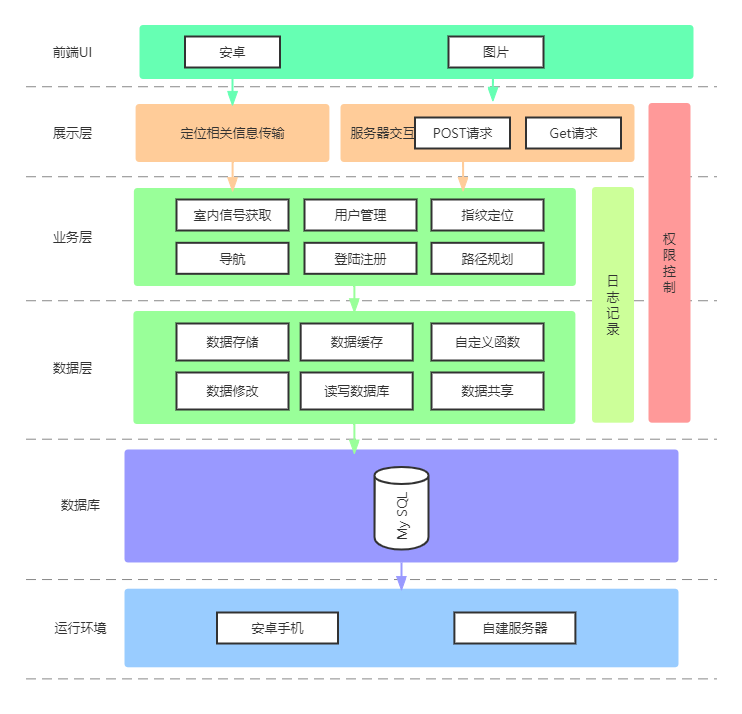
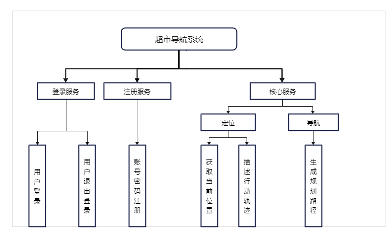

# **基于Wi-Fi指纹的超市定位导航系统**

## 摘要

​	室内环境下的定位一直是一个很多问题未被解决的领域。由于信号的严重衰减和多径效应，通用的室外定位设施（比如GPS）并不能在建筑物内有效地工作。定位准确性也是一个问题，GPS也许可以指出移动设备在哪一个建筑物，但是室内场景下，人们希望得到更精确的室内位置，这需要更精密的地图信息和更高的定位精度。GPS难以解决室内环境下的一些定位问题，大部分室内环境下都存在Wi-Fi，因此利用Wi-Fi进行定位无需额外部署硬件设备，是一个非常节省成本的方法。然而Wi-Fi并不是专门为定位而设计的，传统的基于时间和角度的定位方法并不适用于Wi-Fi。近十年来，在室内Wi-Fi场景下的定位中，位置指纹法被广泛研究和采用。因此，我们根据Wi-Fi指纹这一信息，设计研究这一超市定位系统。

## 技术架构

1） 前端部分

​    前端部分本项目使用Java进行Android开发。其优势在于庞大而完善的生态系统。Java拥有大量的第三方类库，能安全高效跨平台执行。Java编译并运行程序时，必须检查所有可能会遇到的问题以消除错误。它提供了自动垃圾回收功能，防止了程序员在管理内存时犯错误。Java具有良好的可移植性，独立于平台的功能使其易于移植到互联网上的不同计算机上。Java具有高性能的特点。与其他解释和执行语言不同，Java字节码的设计使其可以轻松地将其直接转换为与特定CPU相对应的机器代码，从而获得更高的性能。

基于以上的优势和特点，使用Java进行Android具有实际操作性和可行性。

2） 后端部分

​    后端部分分为数据库和服务器。数据库中我们使用MySQL，数据库存储用户信息与场景交互信息，使用DMS管理系统进行MySQL数据库实例的管理。MySQL是⼀种关系型数据库管理系统，其将数据保存在不同的表中，增加了速度并提高了灵活性。它具有体积小、速度快、总体拥有成本低和开放源码等特点，与本项目的目标特点相符。

​    服务器部分选用Java+Spring+MySQL的方案。Spring具有低侵入设计，代码污染极低，独立于各种应用服务器，基于Spring架构的应用可以实现Write Once，Run Anywhere的承诺，开发者可以自由选择Spring框架的部分或者全部。扩展性能强，有利于本应用的研发。

3） 算法部分

​    算法部分分为核心功能算法和其他功能算法。核心功能算法选用了基于Wi-Fi信号强度的位置指纹法，指纹法是以多个AP的信号强度作为基础，通过数据收集建立一个位置指纹的样本网格。用户方则使用KNN算法的思想，通过用户当前所在位置的多个AP信号强度与样本网格的对比，来获得当前的定位和周边设施的推荐信息。此室内定位算法在市场中有较广泛的应用，因此具有相当的可行性和可实现性。

​    而其他功能算法包括导航中的路径搜索算法，周边推荐中的推荐算法。路径搜索算法选用Floyd算法完成，来找到符合用户目标的最短路径。

## 系统架构设计

​	本项目使用三层架构将系统分为三层，展示层，业务逻辑层，以及数据层，并添加前端UI，数据库和运行环境部分增加图表可读性与丰富性。前端部分主要使用安卓进行开发，并使用自定义图片来改善用户体验。

​	展示层和UI构成架构的最上层，主要包括实现用户界面功能，将用户的需求传达和反馈，并保证用户体验，以及传输定位相关信息与服务器的两种请求交互。

​	业务逻辑层是对具体问题进行逻辑判断与执行操作，位于表示层与数据层中间位置，同时也是表示层与数据层的桥梁。用于实现三层间数据连接和指令传达，通过接收数据进行逻辑处理，并将处理结果反馈到表示层 UI 中，来实现软件功能。

​	数据访问层是数据库的主要操作系统，实现数据的增删查改等操作，并将结果返回给业务逻辑层。本项目使用MYSQL数据库，服务器选择在自建服务器部署，客户端允许用户在安卓手机中运行。

​	以下为本项目的系统架构图：

## 功能结构设计

​	本项目与定位相关的核心业务共包含三个部分：位置界面，个人界面，定位导航界面。室内位置定位主要包括当前WIFI信号强度的获取，定位相关辅助传感器信号获取，以及定位相关算法。目标搜索导航主要包括对导航目标的模糊搜索，路径查找算法，和当前移动的位置记录。

​	以下为本项目主要功能模块图：

